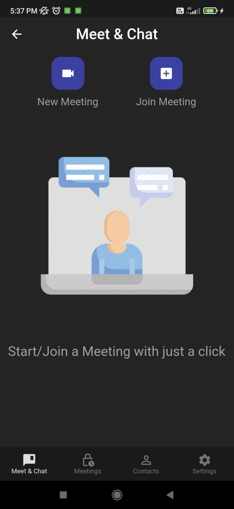
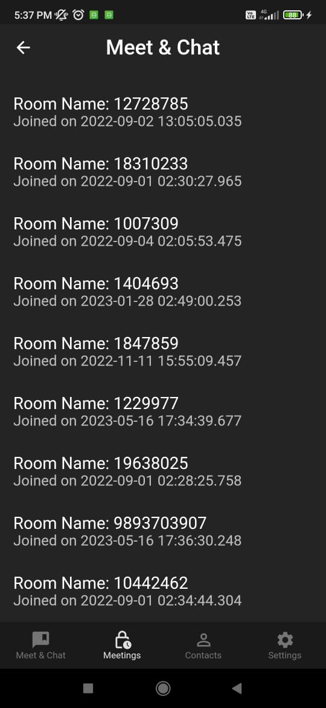

# Lets Meet
Lets - Meet is a Online Meeting App that is Based on Jitsi Server. It is a Free video call and meeting app are designed simply to provide the user with an easy to operate

# App Images

# Installation
- Clone this Repository and use your favorite Editor Like Visual Code or Android Studio.
run Pub get and download all required packages.
- Go to Firebase -> Authentication and enable Login with Email and Password.
- Go to Firestore Database and enable it.
- add SHAI-1 fingerprints in Project Settings
- Download your google-service file and place it in the App folder.
- Hit Like and Share this Repository

# Features
- Google Authentication
- Save History Meetings in Google Firebase
- Create and Join Meetings with One Click.
- Rejoin Meetings

# Video Call Features
- Live Chat with Other Participants
- Mute All Participant
- Lobby Mode (Approve or reject Participant)
- Raise Hand
- Protect Your Meetings with Passwords
- Live Stream
- Share Screen
- Record Your Meetings
- And More..

# Contributing
- Feel Free to Pull a request

Please make sure to update tests as appropriate.