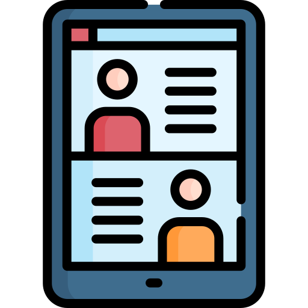
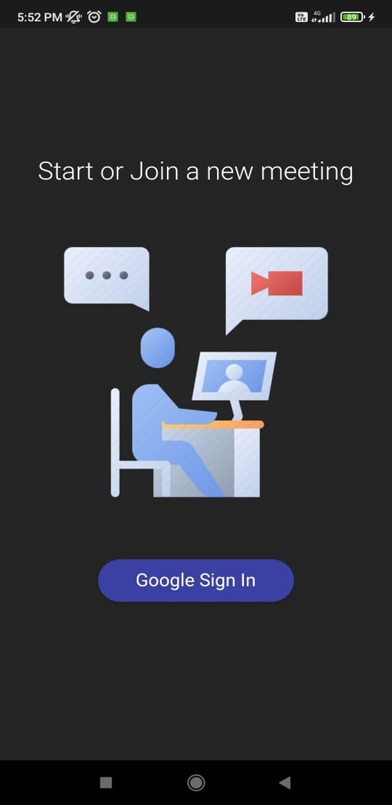
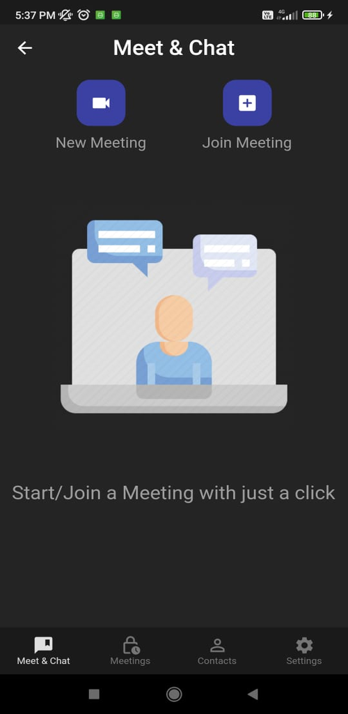
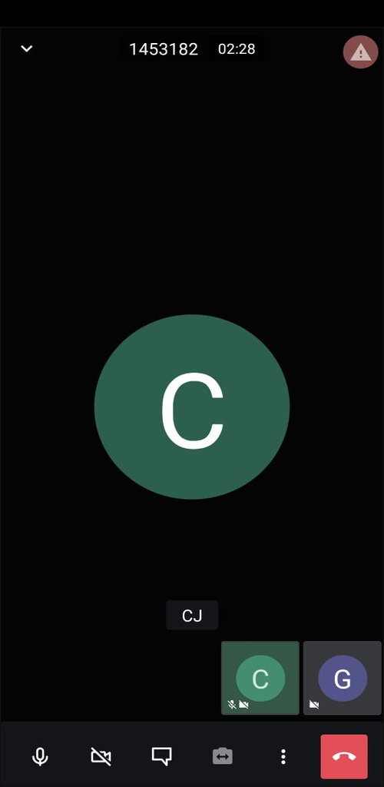
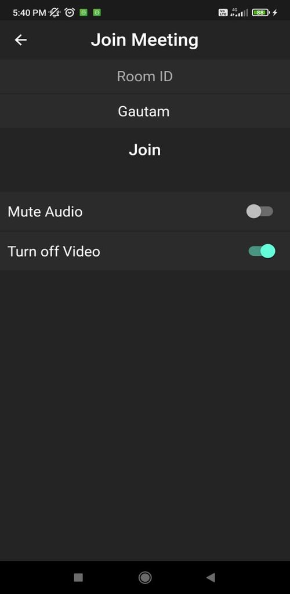
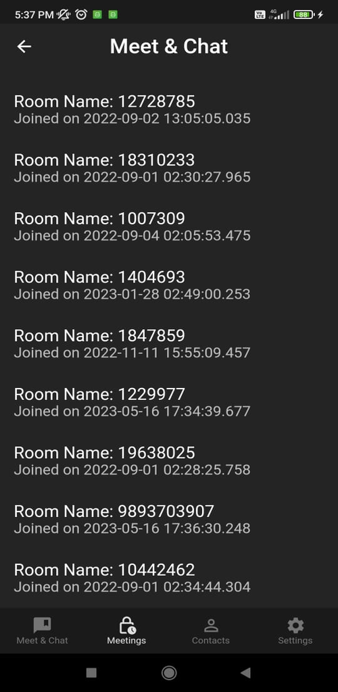

# Lets Meet

Lets-Meet is a Online Meeting App that is Based on Jitsi Server. It is a Free video call and meeting app are designed simply to provide the user with an easy to operate

## App Demo

https://github.com/gautamjain09/LetsMeet-App/assets/85572913/bf5cf8c5-13fa-4b19-b0c1-941160ba615d

## Screenshots

|    |    |
| ---------------------------------------   |   ---------------------------------------  |
|        |     |
|     |   |
|    |  |

## Tech Stacks

| Tools                 |                                     Link                                      |
|:----------------------|:-----------------------------------------------------------------------------:|
| 🤖  Language          |                       [Dart](https://dart.dev/)                               |
|  🩶   Framework         |                     [Flutter](https://flutter.dev/)                         |
| 🌐  Authentication    |                 [Google-Auth](https://firebase.google.com/docs/auth )        |
| 📁  Database          |           [Cloud-Firestore](https://firebase.google.com/docs/firestore)     |
| 📁  State Management  |              [Riverpod](https://pub.dev/packages/flutter_riverpod)            |

## Installation

- Clone this Repository and use your favorite Editor Like Visual Code or Android Studio. run Pub get and download all required packages.
- Go to Firebase -> Authentication and enable Login with Email and Password.
- Go to Firestore Database and enable it.
- add SHAI-1 fingerprints in Project Settings
- Download your google-service file and place it in the App folder.

    
## Features

- Google Authentication
- Save History Meetings in Google Firebase
- Create and Join Meetings with One Click.
- Rejoin Meetings
- Cross platform

## Video Call Features

- Video Call Features
- Live Chat with Other Participants
- Mute All Participant
- Lobby Mode (Approve or reject Participant)
- Raise Hand
- Protect Your Meetings with Passwords
- Live Stream
- Share Screen
- Record Your Meetings
- And More..

## License

[MIT](https://choosealicense.com/licenses/mit/)

## Contributing

Contributions are always welcome!
